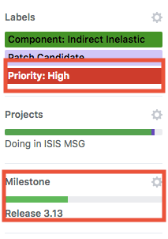
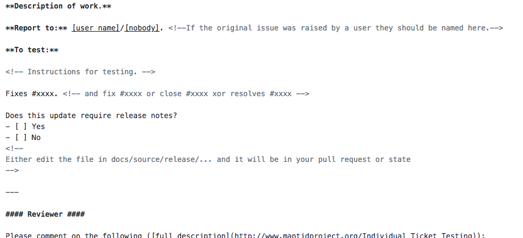
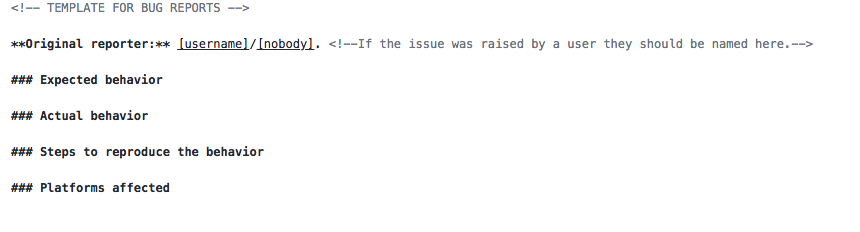

### Issues on Github

 Keith T. Butler

---
### Issues

* Priorities
* Templates
* Etiquette

---
### Priorities

* Importance
* Urgency

---
### Priorities

* Importance
    * High - *must* be included, release could be postponed without
    * None - desireable for relaese, address if at all possible
    * Low - would be nice, but only if time allows
* Urgency

---
### High priority

* What is high priority?
    * Issue is stopping instrument scientists from doing their work
    * Delivery has been promised by the milestone

---
### High priority

* Who sets high priorty?
    * Should not be an individual developer by her/his self
    * Raise with technical steering committee, other senior developers

---
### High means high

* We will not use High Priority as a proxy tag
* A note should be included to explain priority
* Priority should not change arbitrarily 
---
### New templates

* We are proposing new templates for issues/PRs
* Better feedback to original reporter

---
### New templates (issue)

* Name/details of reporter to be included

---
### New templates (PR)

* Name/details of reporter to be included

---
### Reporting back

* Developer is best placed to describe the work
* Gate-keeper signs off on PR
* How to close this loop?
    * Gate keeper writes a comment to developer after closing
    * Gate keeper emails developer after closing
