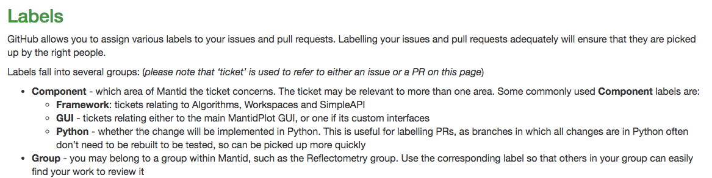
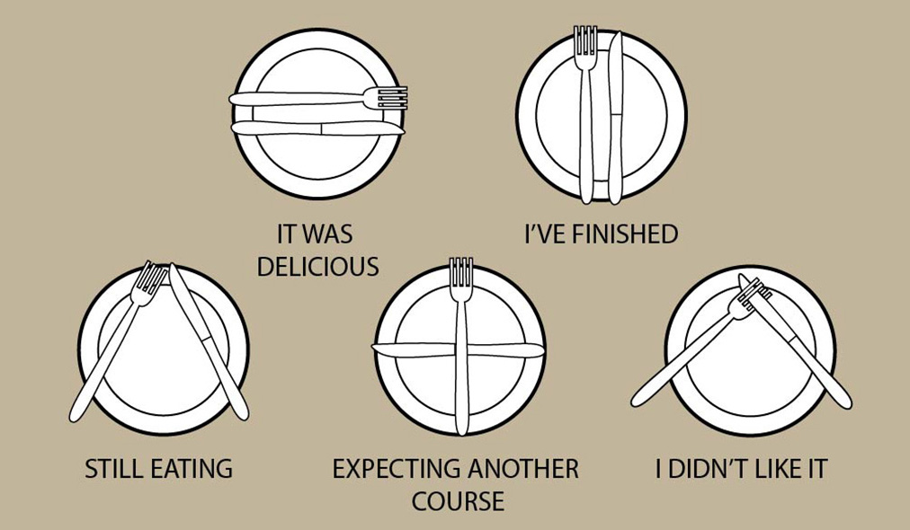

### Issues on Github

 Keith T. Butler

---
### Issues

* Priorities
* Templates
* Etiquette

---
### Priorities

* Importance
* Urgency

---
### Priorities

* Importance
    * High - *must* be included, release could be postponed without
    * None - desirable for release, address if at all possible
    * Low - would be nice, but only if time allows
* Urgency

---
### High priority

* What is high priority?
    * Issue is stopping instrument scientists from doing their work
    * Delivery has been promised by the milestone

---
### High priority

* Who sets high priority?
    * Should not be an individual developer by her/his self
    * Raise with technical steering committee, other senior developers

---
### High means high

* We will not use High Priority as a proxy tag
* A note should be included to explain priority
* Priority should not change arbitrarily 
---
### More on labels

* Visit our useful guidelines

[http://developer.mantidproject.org/IssueTracking.html#issuetrackinglabels](http://developer.mantidproject.org/IssueTracking.html#issuetrackinglabels)
---
### New templates

* We are proposing new templates for issues/PRs
* Better feedback to original reporter

---
### New templates (issue)

* Name/details of reporter to be included

---
### New templates (PR)

* Name/details of reporter to be included

---
### Reporting back

* Developer is best placed to describe the work
* Gate-keeper signs off on PR
* How to close this loop?
    * Gate keeper writes a comment to developer after closing
    * Gate keeper emails developer after closing
---
### Etiquette

* Writing good issues/PRs

---
### Issue etiquette

* Our template is very good - try to follow it
* Clearly state the problem
* Clearly lay out how to reproduce any problems
* Consider giving some background
* Justify the priority it is given
* Remember that anyone in the team could be reading this Issue, so the content and tone may inform people other than those taking part, now or later.

[How to write the perfect Pull Request](https://blog.github.com/2015-01-21-how-to-write-the-perfect-pull-request/)
---
### Try to be good :)

